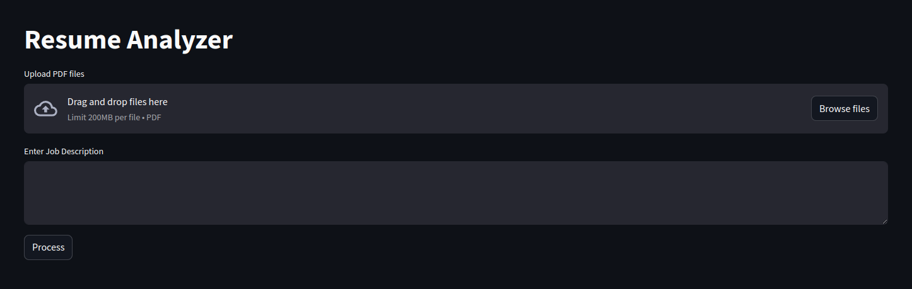
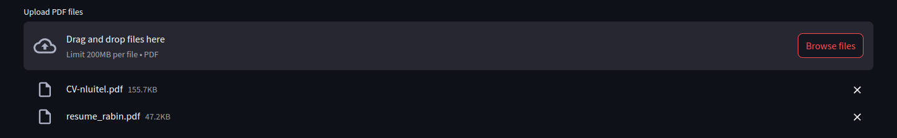
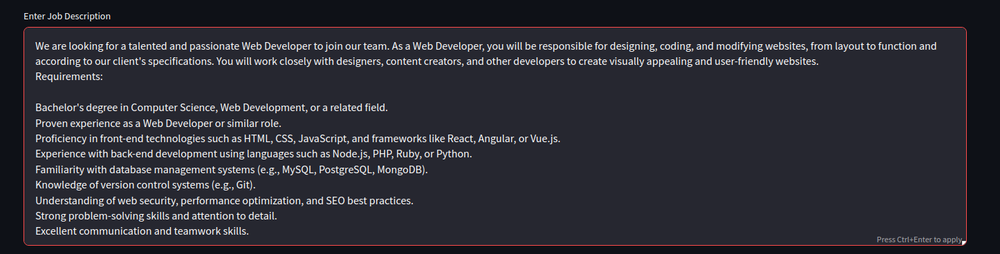
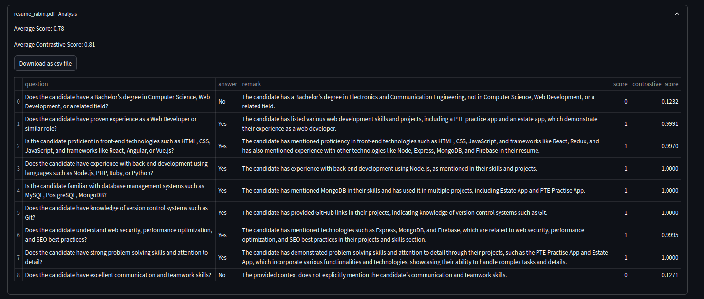

# Resume Analyzer

Resume Analyzer is a tool that leverages Large Language Models (LLM) to analyze multiple resumes. It scores and ranks these resumes based on a provided job description, helping recruiters and hiring managers quickly identify the best candidates.

## Table of Contents

- [Features](#features)
- [Installation](#installation)
- [Usage](#usage)
- [Screenshots](#screenshots)

## Features

- Upload multiple resumes in PDF format
- Provide a job description for analysis
- Utilize advanced LLM to score and rank resumes
- User-friendly interface for easy interaction
- Export resumes and scores in a CSV format

## Installation

To get started with Resume Analyzer, follow these steps:

1. **Clone the repository:**

    ```bash
    git clone https://github.com/bikaldev/resume-analyzer.git
    cd resume-analyzer
    ```

2. **Create a virtual environment and activate it:**

    ```bash
    python -m venv env
    source env/bin/activate  # On Windows, use `env\Scripts\activate`
    ```

3. **Install the required dependencies:**

    ```bash
    pip install -r requirements.txt
    ```

4. **Add a .env file:**
     ```
     #.env file
     GROQ_API_KEY={API KEY HERE}
     GIHUB_ACCESS_TOKEN={ACESS TOKEN HERE}
     ```

4. **Run the application:**

    ```bash
    streamlit run app.py
    ```

## Usage

1. **Upload Resumes:** Upload multiple resumes in PDF format.
2. **Provide Job Description:** Input the job description against which the resumes will be analyzed.
3. **Analyze:** Click the 'Process' button to start the analysis process.
4. **View Results:** View the scored resumes in the results section.
5. **Export Results:** Export the results as a CSV file for further use.

## Screenshots


*Home screen of the Resume Analyzer.*


*Uploading multiple resumes for analysis.*


*Inputting the job description for analysis.*


*Viewing the scored resumes.*
